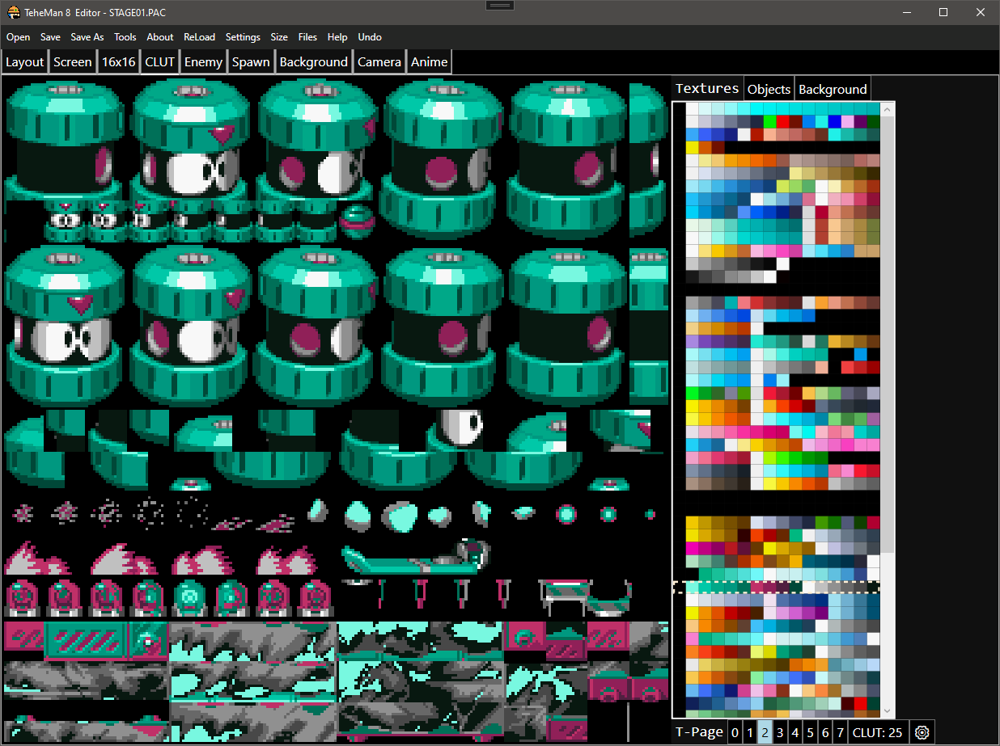
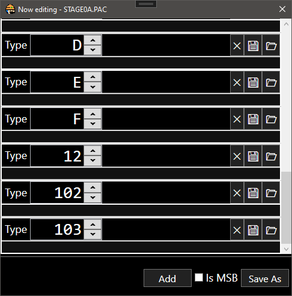
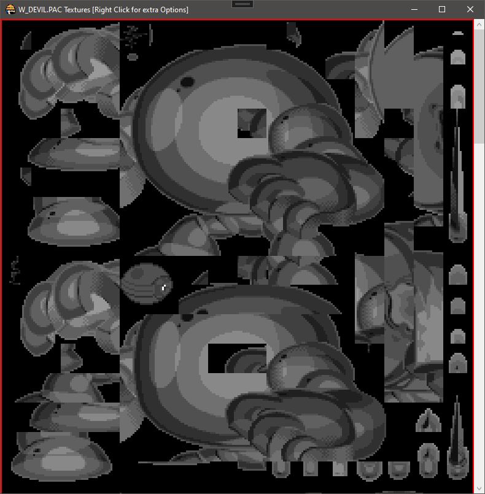

# TeheMan 8 Editor
Level Editor for the PS1 Version of MegaMan 8 which comes packed 
with additional Tools to help with other aspects of the game as well some general purpose PS1 Tools

## Compiling
1st your gonna need Visaul Studio after cloning the repro. After installing Visual Studio use the Visual Studio Install App
to install the .NET Framework 4.7.2 SDK. Next , open the `TeheMan8_Editor.sln` via Visual Studio and set the default project to
`TeheMan8_Editor` and Compile as `Release` then click Start. The EXE should be located in the `bin/Release` folder.

## Source Code
* [ARC.cs](TeheMan8_Editor/ARC.cs) - contains the class for importing and exporting the .ARC file type
* [Const.cs](TeheMan8_Editor/Const.cs) - contains Constants need by the program
* [Enemy.cs](TeheMan8_Editor/Enemy.cs) - the file containing the Enemy class for the enemies in EnemyTab
* [Entry.cs](TeheMan8_Editor/Entry.cs) - helping class for ARC.cs
* [Layout.cs](TeheMan8_Editor/Layout.cs) - contains the classes for saving the editors layout
* [Level.cs](TeheMan8_Editor/Level.cs) - a class representing a Level in the game
* [PSX.cs](TeheMan8_Editor/PSX.cs) - static class containning various functions and tools used through out the editor
* [Redux.cs](TeheMan8_Editor/Redux.cs) - static class contain the HTTP requests code for PCSX Redux's RESTful API
* [Settings.cs](TeheMan8_Editor/Settings.cs) - the file containning the Settings for the editor
* [Undo.cs](TeheMan8_Editor/Undo.cs) - the class representing an Undo
* [WriteFile.cs](TeheMan8_Editor/WriteFile.cs) - a class used by certain tools in PSX.cs

### [Config](TeheMan8_Editor/Config)
Basic config files that are mostly worth ignoring

### [Forms](TeheMan8_Editor/Forms)
A folder containning the the main xaml + C# code for all the tabs + windows

### [Resources](TeheMan8_Editor/Resources)
The folder containning various images , patches , styles that need for compiling